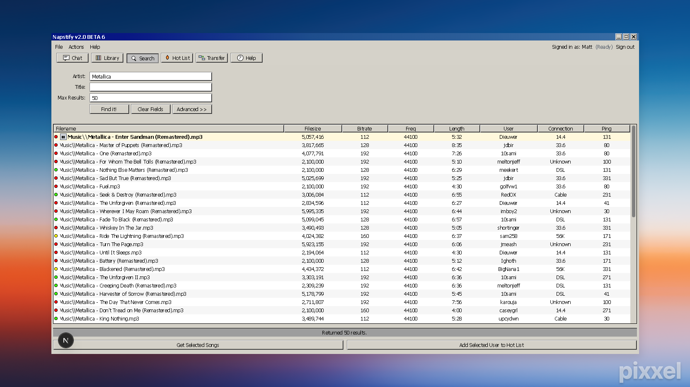

# Napstify v2.0 BETA 6

A nostalgic Napster-style interface that lets you search for artists and play songs via the Spotify API.


## 🎵 Inspiration

This project recreates the nostalgic interface of the original Napster v2.0 client, bringing back the classic Windows 98 aesthetic while providing modern Spotify integration.



*Screenshot made with [getpixxel.com](https://www.getpixxel.com/)*

## ✨ Features

- **Authentic Win98 UI**: A recreation of Windows 98/Napster v2.0 interface
- **Spotify Integration**: Search and play tracks using Spotify's API
- **Full Track Playback**: Spotify Web Playback SDK integration for full tracks
- **Responsive Design**: Works on desktop and mobile devices
- **Classic Napster Feel**: Complete with fake user data, connection types, and file sizes

## 🛠️ Tech Stack

- **Framework**: Next.js 15.5.2 (App Router)
- **Language**: TypeScript 5
- **Styling**: Tailwind CSS 3.3.0 with custom Win98 utilities
- **Authentication**: NextAuth.js 4.24.11 with Spotify OAuth
- **Audio**: Spotify Web Playback SDK
- **Deployment**: Vercel-ready

## 🚀 Quick Start

### Prerequisites

- Node.js 18+ 
- Spotify Developer Account
- ngrok (for local HTTPS development)

### Setup

1. **Clone the repository**
   ```bash
   git clone https://github.com/yourusername/napstify.git
   cd napstify
   ```

2. **Install dependencies**
   ```bash
   npm install
   ```

3. **Set up environment variables**
   ```bash
   cp env.example .env.local
   ```
   
   Fill in your Spotify credentials:
   ```env
   SPOTIFY_CLIENT_ID=your_spotify_client_id
   SPOTIFY_CLIENT_SECRET=your_spotify_client_secret
   
   NEXTAUTH_URL=http://localhost:3000
   NEXTAUTH_SECRET=your_nextauth_secret
   ```

4. **Configure Spotify App**
   - Go to [Spotify Developer Dashboard](https://developer.spotify.com/dashboard)
   - Create a new app
   - Add `http://localhost:3000/api/auth/callback/spotify` to Redirect URIs
   - Copy Client ID and Client Secret to `.env.local`

5. **Generate NextAuth Secret**
   ```bash
   openssl rand -base64 32
   ```
   Copy the output to `NEXTAUTH_SECRET` in your `.env.local`

6. **Start development server**
   ```bash
   npm run dev
   ```

7. **For HTTPS (required for Spotify OAuth)**
   ```bash
   npx ngrok http 3000
   ```
   Update `NEXTAUTH_URL` and Spotify redirect URI with the ngrok URL.


## 🏗️ Project Structure

```
napstify/
├── app/                    # Next.js App Router
│   ├── api/               # API routes
│   │   ├── auth/          # NextAuth.js authentication
│   │   └── search/        # Spotify search API proxy
│   ├── globals.css        # Global styles
│   ├── layout.tsx         # Root layout
│   ├── page.tsx           # Main page
│   └── providers.tsx      # NextAuth provider wrapper
├── components/            # React components
│   ├── AudioController.ts # Audio playback logic
│   ├── Icons98.tsx        # Win98-style icons
│   ├── ResultsTable.tsx   # Search results table
│   ├── SpotifyPlayer.ts   # Spotify Web Playback SDK
│   ├── Toolbar98.tsx      # Win98 toolbar
│   ├── Win98Modal.tsx     # Win98-style modals
│   └── Win98Window.tsx    # Main window component
├── lib/                   # Utility libraries
│   └── spotify.ts         # Spotify API integration
├── types/                 # TypeScript type definitions
│   └── next-auth.d.ts     # NextAuth type extensions
├── tailwind.config.ts     # Tailwind configuration
├── env.example            # Environment variables template
└── README.md              # This file
```

## 🎨 Customization

### Win98 Theme Colors

The Win98 color palette is defined in `tailwind.config.ts`:

```js
colors: {
  'win98': {
    face: '#d5d2c9',      // Main background
    light: '#ffffff',     // Highlight color
    shadow: '#808080',    // Shadow color
    dark: '#000000',      // Border color
    titlebar: '#000080',  // Title bar blue
  }
}
```

### Custom Components

All Win98-styled components use Tailwind utilities:

- `.win98-btn` - 3D beveled buttons
- `.win98-input` - Sunken input fields
- `.win98-titlebar` - Blue gradient title bar
- `.win98-table-header` - Table headers

## 🤝 Contributing

Want to help? Check out [CONTRIBUTING.md](CONTRIBUTING.md) for details. It's pretty simple - just fork, make changes, and submit a PR!

## 📝 License

MIT License - see [LICENSE](LICENSE) for details.

---

Made with ❤️ for all the people who installed viruses on their parents computers.
