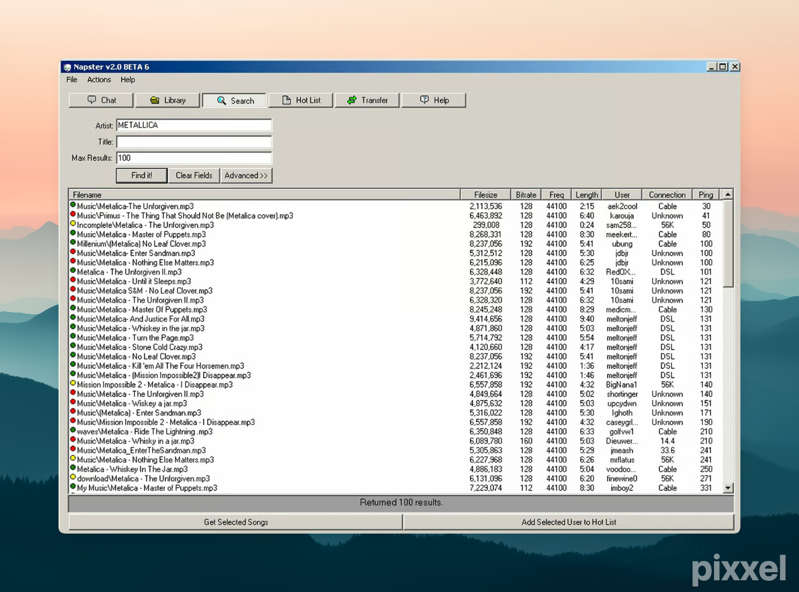

# Napstify v2.0 BETA 6

A Windows 98-style Spotify search interface that recreates the classic Napster v2.0 aesthetic with modern functionality.


## 🎵 Inspiration

This project recreates the nostalgic interface of the original Napster v2.0 client, bringing back the classic Windows 98 aesthetic while providing modern Spotify integration.



*The original Napster v2.0 interface that inspired this project*

## ✨ Features

- **Authentic Win98 UI**: A recreation of Windows 98/Napster v2.0 interface
- **Spotify Integration**: Search and play tracks using Spotify's API
- **Full Track Playback**: Spotify Web Playback SDK integration for full tracks
- **Responsive Design**: Works on desktop and mobile devices
- **Classic Napster Feel**: Complete with fake user data, connection types, and file sizes

## 🛠️ Tech Stack

- **Framework**: Next.js 15.5.2 (App Router)
- **Language**: TypeScript 5
- **Styling**: Tailwind CSS 3.3.0 with custom Win98 utilities
- **Authentication**: NextAuth.js 4.24.11 with Spotify OAuth
- **Audio**: Spotify Web Playback SDK
- **Deployment**: Vercel-ready

## 🚀 Quick Start

### Prerequisites

- Node.js 18+ 
- Spotify Developer Account
- ngrok (for local HTTPS development)

### Setup

1. **Clone the repository**
   ```bash
   git clone https://github.com/yourusername/napstify.git
   cd napstify
   ```

2. **Install dependencies**
   ```bash
   npm install
   ```

3. **Set up environment variables**
   ```bash
   cp env.example .env.local
   ```
   
   Fill in your Spotify credentials:
   ```env
   SPOTIFY_CLIENT_ID=your_spotify_client_id
   SPOTIFY_CLIENT_SECRET=your_spotify_client_secret
   NEXTAUTH_URL=http://localhost:3000
   NEXTAUTH_SECRET=your_nextauth_secret
   ```

4. **Configure Spotify App**
   - Go to [Spotify Developer Dashboard](https://developer.spotify.com/dashboard)
   - Create a new app
   - Add `http://localhost:3000/api/auth/callback/spotify` to Redirect URIs
   - Copy Client ID and Client Secret to `.env.local`

5. **Generate NextAuth Secret**
   ```bash
   openssl rand -base64 32
   ```
   Copy the output to `NEXTAUTH_SECRET` in your `.env.local`

6. **Start development server**
   ```bash
   npm run dev
   ```

7. **For HTTPS (required for Spotify OAuth)**
   ```bash
   npx ngrok http 3000
   ```
   Update `NEXTAUTH_URL` and Spotify redirect URI with the ngrok URL.

## 🌐 Deployment

### Deploy to Vercel (Recommended)

1. **Fork this repository** to your GitHub account

2. **Set up Spotify App** (required):
   - Go to [Spotify Developer Dashboard](https://developer.spotify.com/dashboard)
   - Create a new app
   - Add your production domain to Redirect URIs (e.g., `https://your-app.vercel.app/api/auth/callback/spotify`)
   - Copy Client ID and Client Secret

3. **Deploy to Vercel**:
   - Go to [Vercel](https://vercel.com) and sign up/login
   - Click "New Project" and import your forked repository
   - Add environment variables in Vercel dashboard:
     ```env
     SPOTIFY_CLIENT_ID=your_spotify_client_id
     SPOTIFY_CLIENT_SECRET=your_spotify_client_secret
     NEXTAUTH_URL=https://your-app.vercel.app
     NEXTAUTH_SECRET=your_generated_secret
     ```
   - Deploy!

4. **Generate NEXTAUTH_SECRET**:
   ```bash
   openssl rand -base64 32
   ```

### Deploy to Other Platforms

The app works on any platform that supports Next.js:
- **Netlify**: Similar to Vercel setup
- **Railway**: Add environment variables in dashboard
- **DigitalOcean App Platform**: Configure environment variables
- **Self-hosted**: Set up environment variables on your server

### Important Notes

⚠️ **Spotify Development Mode Limitation**: Each Spotify app is limited to 25 users in development mode. This project is designed to be self-hosted so everyone can have their own instance.

⚠️ **Spotify Premium required** - Full playback requires a Spotify Premium account
⚠️ **Active Spotify session needed** - Users must have Spotify open on another device

## 🔒 Security Features

- **Server-side API calls**: All Spotify API requests go through Next.js API routes
- **Environment variables**: Sensitive credentials stored in `.env.local` (not committed)
- **Input validation**: Search parameters are validated and sanitized
- **Error handling**: Graceful error handling without exposing sensitive information
- **CORS protection**: Built-in Next.js CORS handling
- **Authentication**: Secure OAuth flow with NextAuth.js

## 📖 Usage

1. **Search for Music**: Enter an artist name and optionally a title
2. **Full Playback**: Click any track to sign in with Spotify for full track playback

## 🏗️ Project Structure

```
napstify/
├── app/                    # Next.js App Router
│   ├── api/               # API routes
│   │   ├── auth/          # NextAuth.js authentication
│   │   └── search/        # Spotify search API proxy
│   ├── globals.css        # Global styles
│   ├── layout.tsx         # Root layout
│   ├── page.tsx           # Main page
│   └── providers.tsx      # NextAuth provider wrapper
├── components/            # React components
│   ├── AudioController.ts # Audio playback logic
│   ├── Icons98.tsx        # Win98-style icons
│   ├── ResultsTable.tsx   # Search results table
│   ├── SpotifyPlayer.ts   # Spotify Web Playback SDK
│   ├── Toolbar98.tsx      # Win98 toolbar
│   ├── Win98Modal.tsx     # Win98-style modals
│   └── Win98Window.tsx    # Main window component
├── lib/                   # Utility libraries
│   └── spotify.ts         # Spotify API integration
├── types/                 # TypeScript type definitions
│   └── next-auth.d.ts     # NextAuth type extensions
├── tailwind.config.ts     # Tailwind configuration
├── env.example            # Environment variables template
└── README.md              # This file
```

## 🎨 Customization

### Win98 Theme Colors

The Win98 color palette is defined in `tailwind.config.ts`:

```js
colors: {
  'win98': {
    face: '#d5d2c9',      // Main background
    light: '#ffffff',     // Highlight color
    shadow: '#808080',    // Shadow color
    dark: '#000000',      // Border color
    titlebar: '#000080',  // Title bar blue
  }
}
```

### Custom Components

All Win98-styled components use Tailwind utilities:

- `.win98-btn` - 3D beveled buttons
- `.win98-input` - Sunken input fields
- `.win98-titlebar` - Blue gradient title bar
- `.win98-table-header` - Table headers

## 🤝 Contributing

We welcome contributions! Please see our [Contributing Guidelines](CONTRIBUTING.md) for details.

### Development Setup

1. Fork the repository
2. Create a feature branch: `git checkout -b feature/amazing-feature`
3. Make your changes
4. Test thoroughly
5. Commit: `git commit -m 'Add amazing feature'`
6. Push: `git push origin feature/amazing-feature`
7. Open a Pull Request

### Code Style

- Use TypeScript for all new code
- Follow the existing Tailwind CSS patterns
- Maintain Win98 aesthetic consistency
- Add proper error handling
- Include TypeScript types for new components
- Add JSDoc comments for complex functions

### Security Guidelines

- Never commit sensitive credentials
- Validate all user inputs
- Use environment variables for configuration
- Implement proper error handling
- Follow OWASP security guidelines

## 📝 License

This project is licensed under the MIT License - see the [LICENSE](LICENSE) file for details.

## 🙏 Acknowledgments

- Inspired by the classic Napster v2.0 interface
- Built with modern web technologies
- Spotify API for music data and playback
- NextAuth.js for authentication
- Tailwind CSS for styling

## 🆘 Support

- **Issues**: [GitHub Issues](https://github.com/yourusername/napstify/issues)
- **Discussions**: [GitHub Discussions](https://github.com/yourusername/napstify/discussions)
- **Email**: your-email@example.com

## 🔧 Troubleshooting

### Common Issues

1. **"Invalid redirect URI" error**
   - Make sure your Spotify app redirect URI matches exactly
   - For local development, use ngrok URL

2. **"Missing Spotify credentials" error**
   - Check that `.env.local` exists and has correct values
   - Verify Spotify app credentials are correct

3. **Full playback not working**
   - Ensure you're signed in with Spotify
   - Check that you have Spotify Premium (required for Web Playback SDK)
   - Make sure Spotify is open on another device (desktop app, mobile app, or web player)

---

Made with ❤️ for all the people who installed viruses on their parents computers
